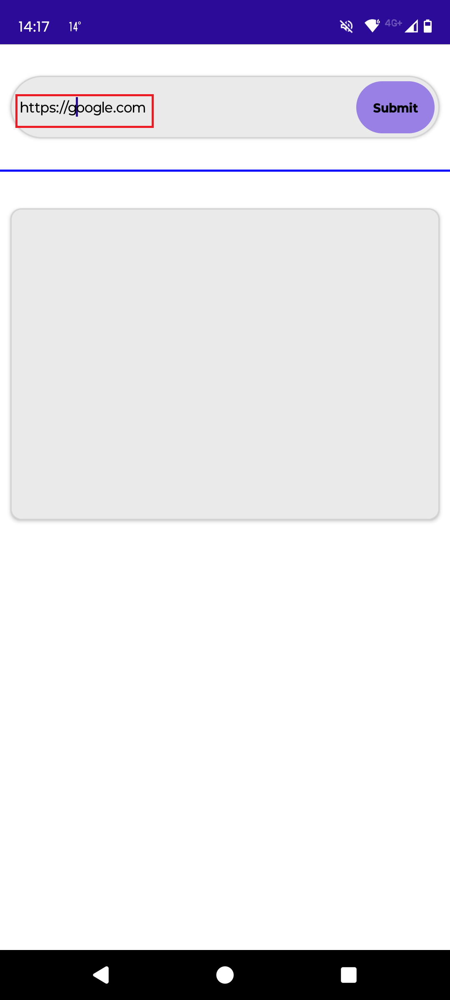
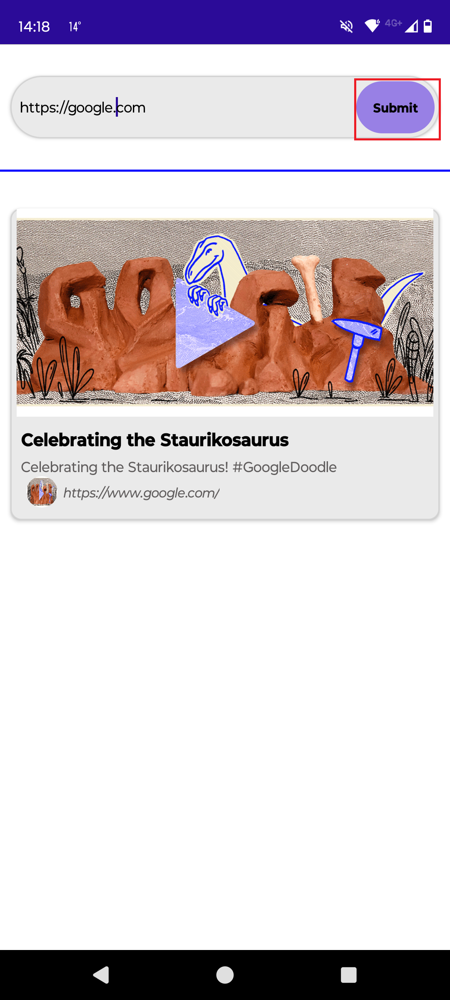
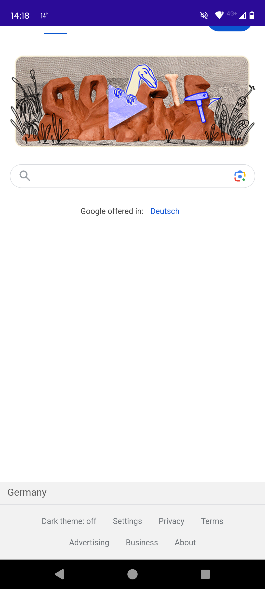
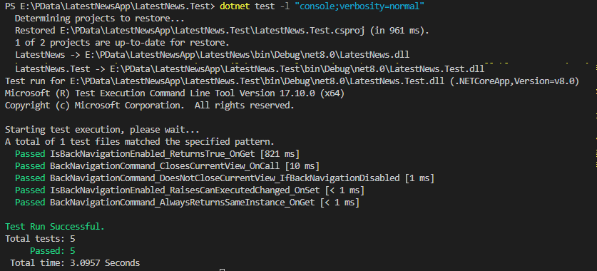

# PreviewLink CrossPlatfrom App

## Develop a .NET MAUI Android app that retrieves and displays link preview information using a public API, like LinkPreview.

This project demonstrates the development of a cross-platform .NET MAUI (Multi-platform App UI) application for Android that generates link previews. The app allows users to input a URL and fetches preview information such as the title, description, and image using a publicly available service like the LinkPreview API. The goal is to provide a simple and effective way to display a summary of web content within the app. This project using the following key features:

* SOLID Principles: The app follows SOLID principles to ensure a clean and scalable architecture.
* MVVM (Model-View-ViewModel) Architecture: Implements the Model-View-ViewModel (MVVM) architectural pattern for clear separation of concerns.
* Dependency Injection: Uses DI to manage services, making the app modular and easily testable.
* HTTPS Communication: Ensures secure data transfer by using HTTPS to fetch preview web information.
* Unit Testing: Includes a unit test project to ensure robust and reliable application functionality.

## How its works
Launch the app, red rectangualr box indicate to perform click or press by user in the app: 

  
  
  
  
  

## How to install or deploy the project
There are two way:
1. Install all the required technical stack for .NET MAUI (Multi-platform App UI) development:
   * Operating System: (Windows 10 or higher) or macOS (Monterey or higher is recommended)
   * Install .NET SDK, Android SDK and Emulator
   * Download and install Visual Studio or Visual Studio Code. Note: For this project I have used Visual Studio Code.
   * Clone the project, buid , run and deploy the project to the Emulator or android device using VS code or Visual studio IDE.
2. I have built the Android apk file; you can test or deploy it on your Android device (rrecommended Android OS 14) just by downloading it.: [Link Text](https://drive.google.com/drive/folders/1k0IpcT0ksoTFQ_gmgVZBWlMbIYiH9bP5?usp=sharing)

## How to run the unit test
1. Requirement: Need to setup, cloan , build and sucessfully run the project.
2. in the terminal navigate to the LatestNewsApp project.
3. Run the run this code dotnet test -l "console;verbosity=normal" in the terminal
4. In the terminal, there will be following result:
   
5. I have only written a few unit tests for demonstration purposes.
