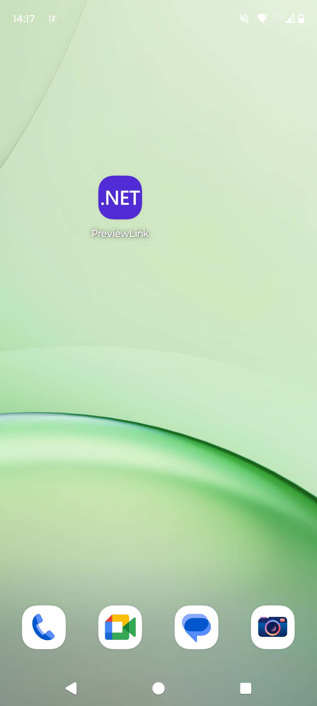
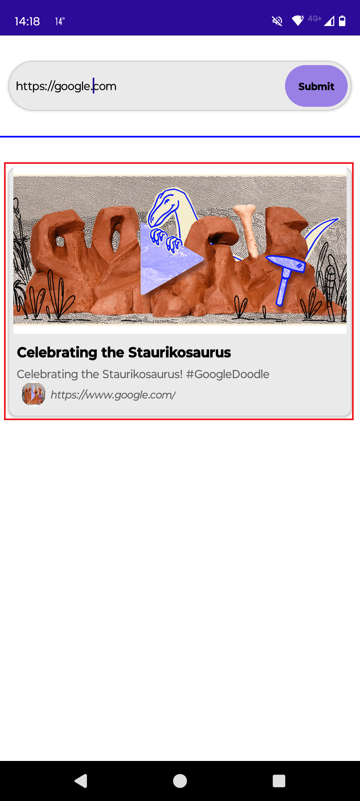

# PreviewLink CrossPlatfrom App

## Develop a .NET MAUI Android app that retrieves and displays link preview information using a public API, like LinkPreview.

This project demonstrates the development of a cross-platform .NET MAUI (Multi-platform App UI) application for Android that generates link previews. The app allows users to input a URL and fetches preview information such as the title, description, and image using a publicly available service like the LinkPreview API. The goal is to provide a simple and effective way to display a summary of web content within the app. This project using the following key features:

* SOLID Principles: The app follows SOLID principles to ensure a clean and scalable architecture.
* MVVM (Model-View-ViewModel) Architecture: Implements the Model-View-ViewModel (MVVM) architectural pattern for clear separation of concerns.
* Dependency Injection: Uses DI to manage services, making the app modular and easily testable.
* HTTPS Communication: Ensures secure data transfer by using HTTPS to fetch preview web information.
* Unit Testing: Includes a unit test project to ensure robust and reliable application functionality.

## How its works
Launch the app, red rectangualr box indicate to perform click or press by user in the app: 

  
  
  

  
  

## How to install or deploy the project

## How to run the unit test
